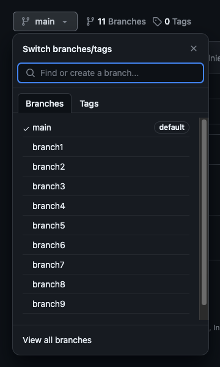

# Forking repositories

This is a follow up to the previous tutorial on GitHub. If you have no idea of what a "commit" is, please refer to the previous tutorial before coming to this one.

## What the fork is a fork?
From the GitHub documentation: "A fork is a new repository that shares code and visibility settings with the original “upstream” repository.". In other words, a fork is a copy of a repository from another account into your GitHub account. Different from when you clone a repository, you are not making the copy into your local machine, you are making it in your GitHub.

## Branching vs Forking
Why would we use forks in the first place when we can you just branchs?
What can happen is when you are in a team with multiple people, a lot of branching can happen and that pollutes the main repository. So you might end up having more 10 different branches that you need to look at to find the one you are trying to actually merge in.



With forking, all the branchs you are working on stay within your copy of the repository and will only be visible to the main repository when you say so.

If you think about it, forking is a divide and conquer algorithm! You divide the branches into repositories for each person and then when everyone is ready, everyting gets merged in (conquered).

Instead of having a remote and local where you do branches from the local to the remote now you have 2 remotes and a local where you do branches from one remote to the other one. So things can get tricky here, so do not feel discourage if you struggle.


## Prerequisites
- Have experience with an operating system of your choice (macOs, Windows or Linux)
- Have experience using terminal commands
- Have a computer and stable internet connection
- Have a terminal installed of your preference, I recommend iTerm for macOS
- Have a text editor or Integrated Development Environment (IDE) installed (like VSCode)
- Have experience with branching on GitHub


## Table of Contents
- [Steps on Forking](#steps)
- [Glossary of Terms](#glossary)
- [List of Commands](#commands)


## STEP BY STEP GUIDE
Step 1. Go to the repository you want to fork. For this tutorial I will be using Obojobo's repository.

Note: the visibility of your fork will corelate with the visibility of the fork.

You have the option to change the name of the fork and the description. You can also decide if you want to copy just the main or all branches.

Once you are done updating all settings, you can click "Create Fork"

# IMAGE

After the fork is done syncing, you should be at a new page that says "github.com/USERNAME/repo-name", in my case "github.com/nizolnier/Obojobo"


Step 2. Clone the fork into your local machine. This can either be done with HTTPS or SSH depending on what you are using but do take a note of which one you are!

# IMAGE

Step 3. After cloning, it is time to establish a connection with UCFOpen's Obojobo. Right now, your local copy knows nothing, it doesn't know who is the parent repository.

You can verify this by doing ```git remote show -n``` and you will only see ```origin```.

# IMAGE

With new powers comes new vocabulary! From this moment on, we will be referring to UCFOpen's Obojobo as ```upstream``` or ```parent```, and our fork as ```origin``` or our fork.

With that in mind, let's add the parent connection!

Remember when I said that you needed to remember if you used HTTPS or SSH to clone? This is going to come handy right now.

Go back to your browser and open a tab to the parent repository (UCFOpen's Obojobo). Click on code and then copy the link to clone. If you used HTTPS before, use it now, same goes for SSH.

# IMAGE

Go back to the terminal and type the command ```git remove add upstream <ucf open's obojobo url>```.

# IMAGE

To check if the command work, run ```git remote show -n```, you should see ```origin``` and ```upstream```

# IMAGE

Step 4. Get the branches from the upstream, run ```git fetch upstream```

We need to get a copy of the main branch from the parent repository into our local machine so we can send pull requests to it.

# IMAGE

Step 5. git branch --set-upstream-to upstream/main

# IMAGE

Step 6. git checkout -b issue/num-description

# IMAGE

Step 7. Add files

# IMAGE

Step 8. git push -u origin branch-name

# IMAGE

Step 9. open pr

Special Verison for Two People


two people: (working on somebody else's fork)
git remote add name (elias) location (elias' fork)
git fetch elias
git checkout branch-name (might have to specify the fork, call for help)
git commit, git push

### GLOSSARY OF TERMS
- fork:
-

### LIST OF COMMANDS
- git remote show -n
- git remote add name (upstream) location (main repo url)
- git remote show
- git fetch upstream
- git branch --set-upstream-to upstream/main
- git status
- git checkout -b issue/num-description
- git commit
- git push -u origin branch-name
- git remote add name (elias) location (elias' fork)
- git fetch elias
- git checkout branch-name (might have to specify the fork, call for help)
- git commit, git push
