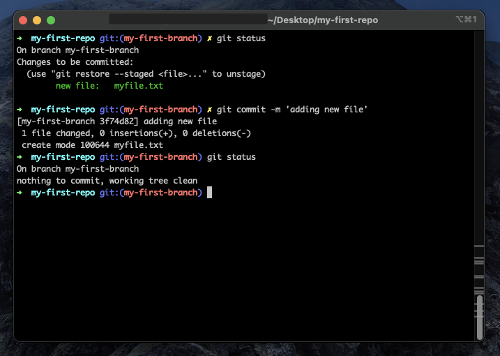

# How to use Git and Github
## What is GitHub?
GitHub is a platform to share coding projects and have version control of them and it works as an open-source community for programmers. It is a Google Drive but for code, so you have all the documents and multiple versions of it. In this set of instructions, I will teach you how to create a repository and use the basic commands of GitHub in Git, a version control tool.

## Prerequisites
- Have experience with an operating system of your choice (macOs, Windows or Linux)
- Have experience using terminal commands
- Have a computer and stable internet connection
- Have a terminal installed of your preference, I recommend iTerm for macOS
- Have a text editor or Integrated Development Environment (IDE) installed (like VSCode)

## Table of Contents
- [Steps on How to use GitHub with Git](#steps)
- [Glossary of Terms](#glossary)
- [List of Commands](#commands)

<a id="steps"></a>
## STEP BY STEP GUIDE
#### Step 0. Create a GitHub account and install Git on your machine.
To create an account, all you need to have is an email and follow the Sign-Up instructions on the website.
Installing Git is pretty straightforward, but I would recommend following [this tutorial](https://www.linode.com/docs/guides/how-to-install-git-on-linux-mac-and-windows/) if you have any questions.

#### Step 1. Create a repository
A repository is a big folder that will hold all your files and create a connection between remote (GitHub) and your local computer.
To create one, click on the + icon at the top right corner of the screen. It is located after your profile picture.
This will open a menu, click on ```New Repository```.


By now, you should be redirected to another page on GitHub with the title ```Create a new Repository```.

Give a name and decide if you want it to be public (visible to everyone) or private (visible to only people you want to see). Add a README file to describe your project and a .gitignore to not add certain files to your project.
You can also choose a license to set the user privileges others will have with your repository. When you are ready, click on the green button that says "Create Repository".


#### Step 2. Clone the repository to your local machine (your computer)
Once you finished creating the repository, it is time to create a copy of it on your machine. For that, on the code page of your repository, click on the green button that says ```code```.
After that, copy the HTTPS link that will be generated.

Note: the link you copy might change depending on the repository. Many times, for companies, they require you to clone the repository with SSH.


In your computer and in the folder you want your project to be on, open a terminal.
Type ```git clone ```, paste the link that you have previously copied, and press enter.
If the command is successful, it will say something like ```Receiving objects: 100% (4/4), done.``` at the end.
If you enter ```ls``` on the terminal, you should also see a new folder with the name of your repository.


#### Step 3. Create a new branch and enter it
Since we are good programmers, we would never just move all our files into the main branch because this can cause conflict and bugs. In a more professional environment, your main branch is the one that is being used to host the program you are creating so it always has to be stable. You do not want your program to stop running because you added something new that was not tested properly. Therefore, here comes the use of branches, controlled spaces away from the main branch for you to mess the code and make changes.


In your terminal, go to the folder of your repository by typing ```cd  ``` and the repository name.
Type ```git checkout -b ```, create a name for the branch, and press enter. This will create a new branch and enter it.
If your command is successful, it should display "Switched to a new branch" and you should not be in the main branch anymore.


#### Step 4. Create the files you need or if the files are ready, move them to the repository.
Now that you have your repository locally and your branch ready, it is time to add your files and folders, which can be done either using the terminal, an IDE, or the file explorer.
In your terminal, run the command ```git status``` and you should see your files with a red color.


#### Step 5. Add these changes to the staging process
Once you are done with your files, it is time to begin the ```uploading``` process back to GitHub. For that, we will start by staging our changes.
In your terminal, enter the command ```git add .```. The ```.``` means you will be adding all the files, just to save time from typing all of them up.
Run the command ```git status``` and your files should now be in a green color.


#### Step 6. Commit the changes and add a message
To save the changes, you create a commit with a message to explain what you did.
Type the command ```git commit -m ``` followed by a small message inside quotes and press enter.
If the command is successful, it should tell you how many files were changed. Also, if you run ```git status```, it should tell you that the branch is clean.



#### Step 7. Push the changes to remote
It is time to push your changes to GitHub. For that, type ```git push origin ``` along with the name of the branch and press enter.
If the command is successful, it should display ```Create a pull request```.


#### Step 8. Open a pull request
You are now going to inform others of your changes and request to merge them to the main branch.
Go back to your browser and the GitHub repository.
In the code page, click on the green button that says ```Compare and pull request```.


This will send you to a new screen, where you can better explain your changes and request for others to review your code.
When you are ready, click on the green button that says ```Create pull request```.


#### Step 9. Merge the pull request into main
Once your pull request is reviewed or when you are ready to merge it, in the pull request screen on GitHub, click on the green button that says ```Merge pull request``` and then ```Confirm merge```.
If the merge is successful, you can delete the branch.


#### Step 10. Update the main branch
It is time to reflect these changes to your local main branch. For that, go back to the terminal and enter ```git checkout main``` to leave your branch and return to the main.
After that, run ```git pull origin main``` to get the changes.
If the command is successful, it should say how many files were changed and you should see them in your repository folder.


#### Step 11. Repeat steps 3-10 for every new feature in your repository.

Congratulations! Now you know the basics of Git and GitHub. It is completely normal to still run into problems in the beginning because this is a skill that requires time and dedication. However, once you get enough practice with the commands, you will be doing it like it was muscle memory.

<a id="glossary"></a>
## GLOSSARY
- Remote: GitHub server
- Local: your computer
- Repository: a big folder with all your files
- Branch: a space in your repository to develop features and fix bugs without messing up everything
- Main: the mother branch, the branch to all branches
- Commit: allows you to save your staged changes
- Clone: creating a copy of the remote to local
- Pull Request: when you want to merge changes from a branch into main, you request to pull

<a id="commands"></a>
## LIST OF COMMANDS
- ```git clone <link>```: create a copy of your remote repository to local
- ```ls```: list files in a directory
- ```cd <folder>```: enter a directory
- ```git checkout -b <branch name>```: create a branch and enter it
- ```git status```: check the status of files in the branch
- ```git add .```: add all files to staging
- ```git commit -m "<message>"```: save changes made in branch
- ```git push origin <branch name>```: send changes from local to remote
- ```git checkout main```: go back to main branch
- ```git pull origin main```: update main branch

